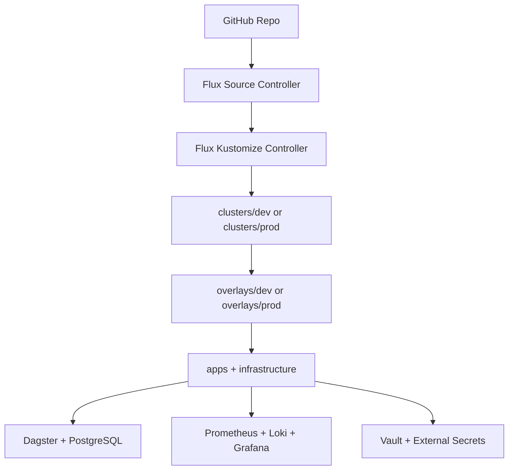

# GitOps Platform

[](https://github.com/jamesoost/gitops-platform/actions/workflows/gitops-pr-validation.yml)
[](LICENSE)

[](https://fluxcd.io/)
[](https://kubernetes.io/)
[](https://helm.sh/)
[](https://www.vaultproject.io/)
[](https://prometheus.io/)
[](https://grafana.com/oss/loki/)
[](https://grafana.com/)
[](https://www.postgresql.org/)
[](https://dagster.io/)

This repository implements a working Kubernetes GitOps platform using FluxCD. It brings together declarative application delivery, runtime secret management, and observability through a platform comprising Dagster, PostgreSQL, Vault, External Secrets, Prometheus, Loki, and Grafana. The implementation is intentionally scoped to a single-node local cluster while preserving production architectural patterns, with the design decisions and production considerations documented throughout the repository.

## What Is Implemented

- GitOps deployment via FluxCD, with separate dev and prod environments, each independently deployable.
- Dagster, a data orchestration platform, backed by its own PostgreSQL database.
- HashiCorp Vault backed secret management, keeping app credentials out of Git.
- A monitoring stack (Prometheus, Loki, Grafana) for metrics, logs, and dashboards.
- Automated CI validation on every pull request via a GitHub action.

See [docs/architecture.md](docs/architecture.md) for implementation details and source references.

## Quick Start

Follow the full guide in [docs/getting-started.md](docs/getting-started.md).

Bootstrap example:

```bash
export GITHUB_TOKEN=<YOUR_GITHUB_PAT>

flux bootstrap github \
  --owner=<GITHUB_OWNER> \
  --repository=<REPO_NAME> \
  --branch=main \
  --path=clusters/dev \
  --personal

flux check
flux get kustomizations
```

## Architecture Snapshot



Full details: [docs/architecture.md](docs/architecture.md)

## Key Engineering Decisions

| Decision | Why It Was Chosen | Trade-off |
| --- | --- | --- |
| Flux + Kustomize overlays | Keeps a single source of truth in Git with a clean separation between shared platform state and environment-specific tuning, so dev/prod drift is visible in diffs rather than hidden in cluster state | Requires discipline to keep overlay patches minimal and readable |
| HelmRelease for stateful apps | Pins exact chart versions and makes upgrades declarative and auditable through Git history, instead of relying on manual `helm upgrade` runs | Chart internals can hide complexity during incident debugging |
| Vault + External Secrets | Keeps app credentials out of Git entirely while still allowing per-app, policy-scoped access with no single shared credential that could leak broadly | Manual unseal in this demo increases operational overhead |
| Standalone Grafana | Explicitly disables the embedded Grafana available in both kube-prometheus-stack and loki-stack (`grafana.enabled: false`), running Grafana as its own release allows for full control over datasource and dashboard provisioning | Additional HelmRelease to maintain |
| CI split: app lint blocking, monitoring lint advisory | Protects the core app deployment path from regressions while still surfacing monitoring chart risks for follow-up, rather than treating all lint findings as equally merge-blocking | Monitoring issues can still merge if not manually addressed |

## Docs Map

- [Getting Started](docs/getting-started.md): prerequisites, bootstrap, verification, access, teardown.
- [Architecture](docs/architecture.md): repository layout, reconciliation flow, and environment model.
- [Vault and Secrets](docs/vault.md): Vault initialization, unseal/recovery, and app secret bootstrapping.
- [Monitoring](docs/monitoring.md): stack topology, datasource and dashboard provisioning, and checks.
- [CI](docs/ci.md): validation pipeline and what blocks merges.
- [Scaling](docs/scaling.md): production-readiness considerations and next-stage design choices.
- [Troubleshooting](docs/troubleshooting.md): common failure modes and fast recovery commands.

## Current Limitations

- Built and tested as a single-node local demo environment on a 4 vCPU and 16GB Ram VM running Debian.
- Vault is single-replica with manual unseal.
- No long-term metrics or logs retention backend.

These reflect both intentional scope decisions and constraints from running on a single local machine.

See [docs/scaling.md](docs/scaling.md) for production-oriented guidance.

## Future Improvements

- Add Dagster metrics scraping and RED dashboards.
- Add alert routing and runbook-linked alerts.
- Migrate from example user-code image to a project-owned image.
